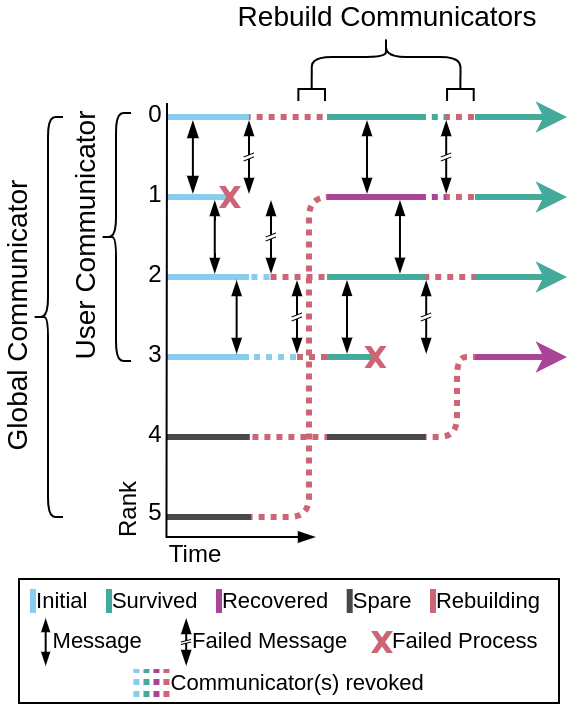

Introduction
============

Fenix is a software library compatible with the Message Passing
Interface (MPI) to support fault recovery without application
shutdown. Fenix has two components: process recovery and data
recovery. Process recovery is used to repair communicators whose
ranks suffered failure detected by the MPI runtime. Data recovery
is an optional feature that can be used to implement a
high-performance in-memory checkpoint/restart mechanism.

Below is a brief overview of these two components, but see the
:doc:`guides/process-recovery` and :doc:`guides/data-recovery`
topics for more details.

Process Recovery
----------------

The core feature of process recovery is creation of a resilient
communicator that will automatically repair itself. This recovery
is achieved by setting aside some number of ranks as *spare ranks*.
When a failure is detected, the spare ranks are used to replace
the failed ranks.

The exact process of recovery is subject to some nuances of the Open MPI
ULFM (User Level Failure Mitigation) specification, which Fenix is built upon.
ULFM provides the low-level mechanisms for detecting failures and rebuilding
communicators. For example, messages may have locally succeeded while failing
on other participating ranks, which ULFM detects and Fenix handles automatically.

   An example process flow diagram for recovery using Fenix

The default recovery pattern uses ``longjmp`` (a C library function that jumps
to a previously saved program state) to return execution to the location of
:c:func:`Fenix_Init` following communicator repairs. This emulates the typical offline
checkpoint/restart pattern, but without the need to restart the application.
However, ``longjmp`` requires careful handling (stack variables should be declared
``volatile``) and C++ destructors may not be called. Fenix also supports two non-jumping
resume modes: **return-based recovery** (RESUME_RETURN) which returns error codes, and
**exception-based recovery** (RESUME_THROW) which throws ``CommException`` on failure.
For C++ applications, the recommended practice is to use exception-based recovery,
providing clean error handling without longjmp's complications.

Data Recovery
-------------

Fenix provides its own redundant data storage API to facilitate
data recovery along with process recovery, but the user can choose
other data recovery options to meet a variety of application needs.
For example, data could be recovered by approximately interpolating
values from unaffected, topologically neighboring ranks instead of
by reading stored redundant data. In addition, the user may decide
to use external libraries such as
`VeloC <https://veloc.readthedocs.io/en/latest/>`_.

.. note::
   Any Fenix function without a return type, e.g. :c:func:`Fenix_Init`, may be
   implemented via macros, in which case it cannot be used to resolve
   function pointers.
